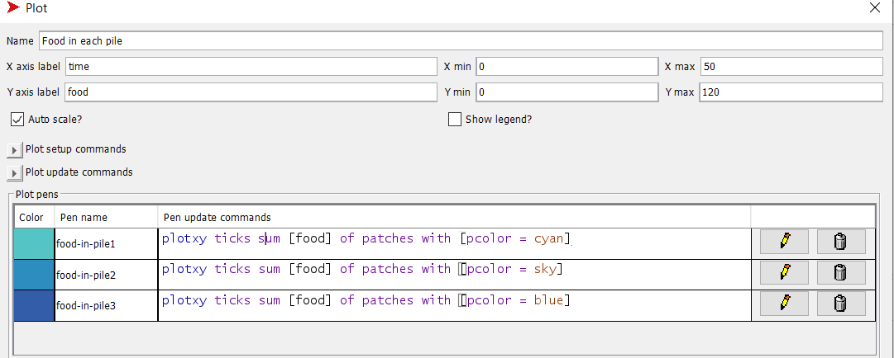
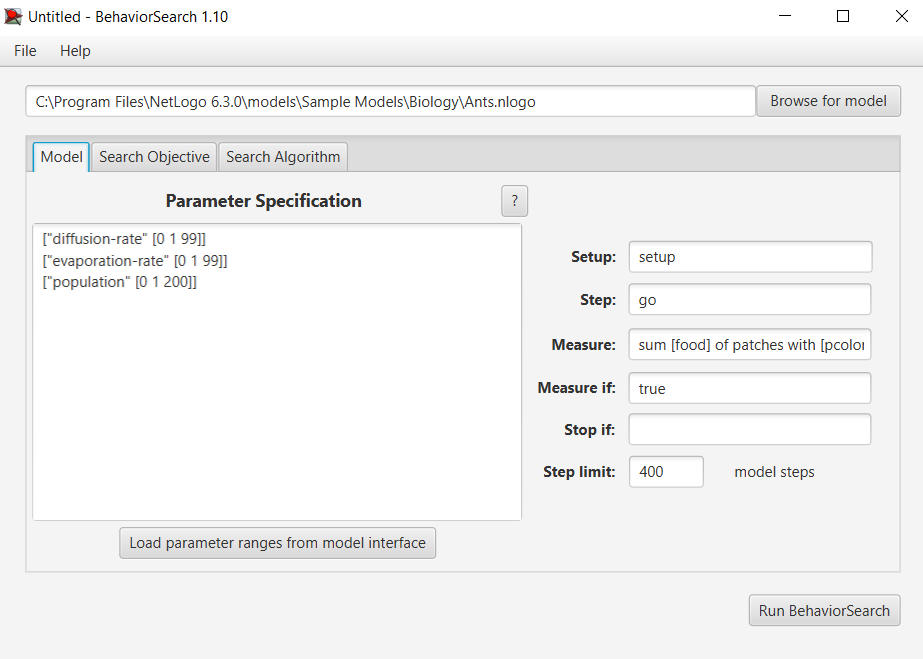
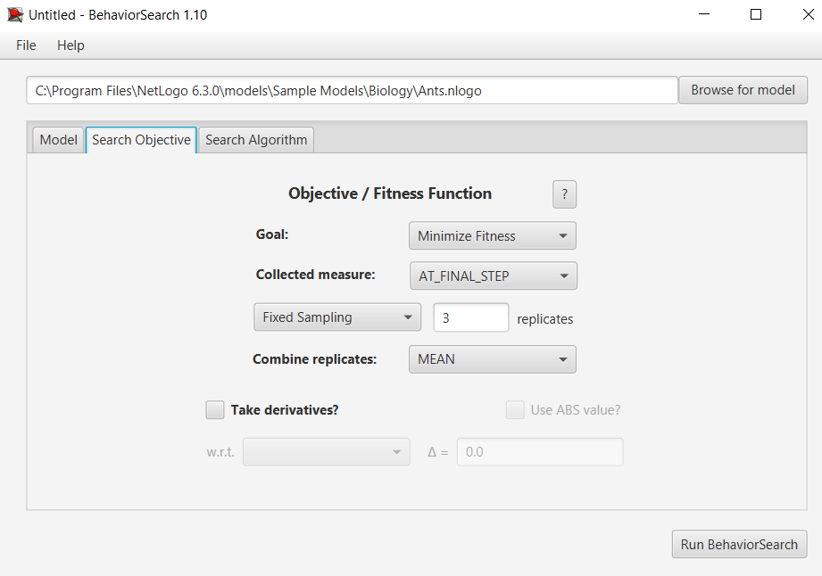
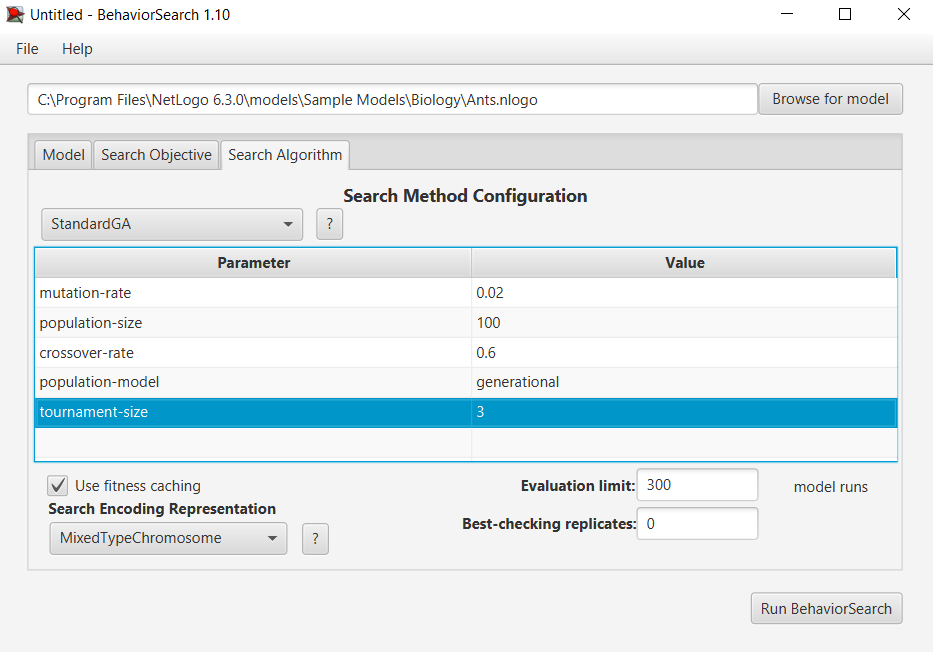
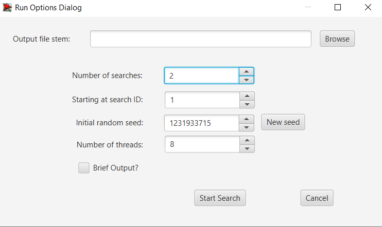
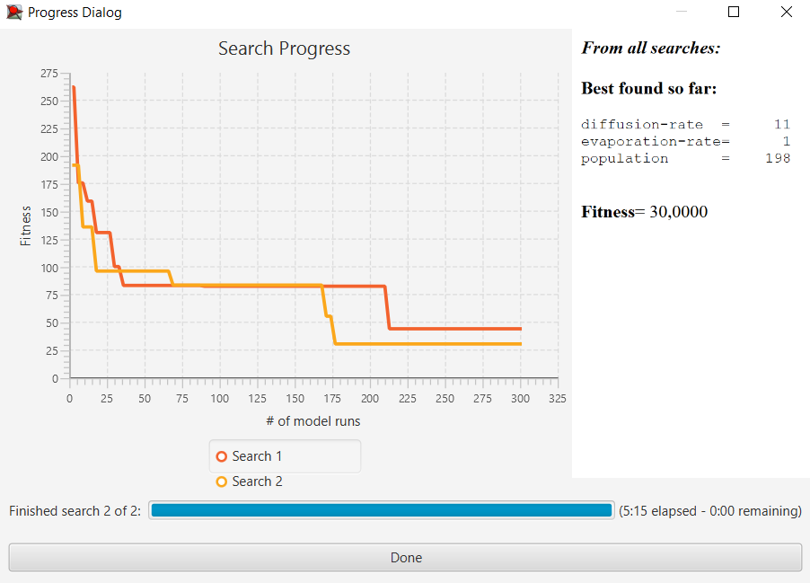
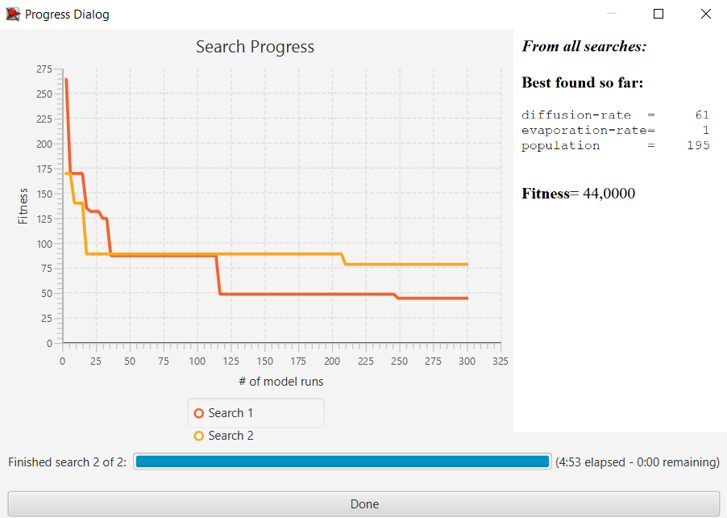

## Комп'ютерні системи імітаційного моделювання
## СПм-23-4, **Кононенко Анастасія Ігорівна**
### Лабораторна робота №**3**. Використання засобів обчислювального интелекту для оптимізації імітаційних моделей

 

### Варіант 10, модель у середовищі NetLogo:
[Ants](https://www.netlogoweb.org/launch#http://www.netlogoweb.org/assets/modelslib/Sample%20Models/Biology/Ants.nlogo)

 

#### Вербальний опис моделі:
Симуляція колонії мурах, які шукають їжу. Кожна мураха моделюється агентом, який дотримується простого набору правил: коли мураха знаходить шматок їжі, вона несе їжу назад у гніздо, кидаючи хімікат під час руху. Коли інші мурахи «нюхають» хімікат, вони слідують за хімікатом до їжі.
 

### Налаштування середовища BehaviorSearch:

**Обрана модель**:

<pre>
C:\Program Files\NetLogo 6.3.0\models\Sample Models\Biology\Ants.nlogo
</pre>

**Параметри моделі** (вкладка Model):

<pre>
["diffusion-rate" [0 1 99]]
["evaporation-rate" [0 1 99]]
["population" [0 1 200]]
</pre>

Використовувана **міра**:  
Для фітнес-функції *(вона ж функція пристосованості або цільова функція)* було обрано **кількість їжі у всіх джерелах їжі**, вираз для  її розрахунку взято з налаштувань графіка аналізованої імітаційної моделі в середовищі NetLogo 

та вказано у параметрі "**Measure**":
<pre>
sum [food] of patches with [pcolor = cyan] + sum [food] of patches with [pcolor = sky] + sum [food] of patches with [pcolor = blue]
</pre>
Кількість їжі враховується **на останньому кроці**. Тривалість симуляції 400 тактів.
Параметр зупинки за умовою ("**Stop if**") не використовувався.
Загальний вигляд вкладки налаштувань параметрів моделі:

**Налаштування цільової функції** (вкладка Search Objective):  
Метою підбору параметрів імітаційної моделі, що описує колонію мурах є **мінімізація** кількості їжі в джерелах - це вказано через параметр "**Goal**" зі значенням **Minimize Fitness**. Тобто необхідно визначити такі параметри налаштувань моделі, у яких мурахи збирають якнайбільше їжі за відведений час.
Щоб уникнути викривлення результатів через випадкові значення, що використовуються в логіці самої імітаційної моделі, **кожна симуляція повторюється по 3 рази**, результуюче значення розраховується як **середнє арифметичне**.
Загальний вигляд вкладки налаштувань цільової функції:

**Налаштування алгоритму пошуку** (вкладка Search Algorithm):
Загальний вид вкладки налаштувань алгоритму пошуку:

 

### Результати використання BehaviorSearch:

Діалогове вікно запуску пошуку:

Результат пошуку параметрів імітаційної моделі, використовуючи **генетичний алгоритм**:

Результат пошуку параметрів імітаційної моделі, використовуючи **випадковий пошук**:

